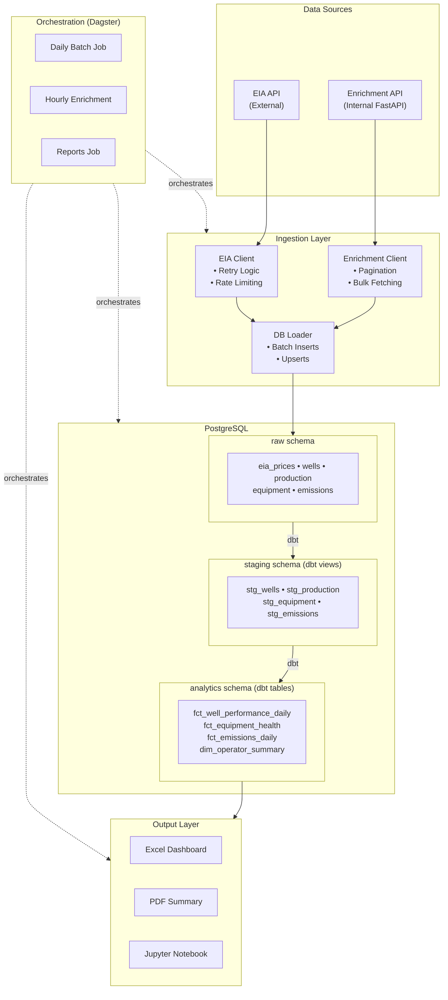

# Architecture Documentation

## Overview

This technical assessment implements a production-ready data pipeline for energy analytics, demonstrating modern data engineering practices including API integration, medallion architecture, dbt transformations, and orchestration with Dagster.

## System Architecture

## Data Flow

### 1. Ingestion Phase

**EIA Data Pipeline:**
1. Fetch natural gas prices (daily/weekly series)
2. Fetch petroleum spot prices (Brent, WTI)
3. Fetch production data by region
4. Load to raw schema with upsert logic

**Enrichment Data Pipeline:**
1. Fetch bulk daily snapshot from internal API
2. Parse wells, production, equipment, emissions data
3. Load to respective raw tables with upsert logic

### 2. Transformation Phase (dbt)

**Staging Layer (Views):**
- Clean and standardize column names
- Calculate derived metrics (water cut, GOR, BOE)
- Convert data types
- Apply basic validation

**Intermediate Layer (Ephemeral):**
- Join wells with production data
- Join wells with equipment data
- Prepare for final aggregations

**Analytics Layer (Tables):**
- `fct_well_performance_daily`: Revenue estimates, production metrics
- `fct_equipment_health`: Maintenance priority scoring
- `fct_emissions_daily`: Environmental risk categorization
- `dim_operator_summary`: Operator-level KPIs

### 3. Reporting Phase

- Excel dashboard with production charts
- PDF executive summary
- Jupyter notebook for ad-hoc analysis

## Scalability Considerations

### Current Design
- Batch processing suitable for daily/hourly updates
- Single PostgreSQL instance
- Synchronous job execution

### Future Scaling Options

**Data Volume:**
- Implement incremental dbt models with `is_incremental()` macro
- Add table partitioning by date (production, emissions)
- Consider columnar storage (e.g., TimescaleDB extension)

**Compute:**
- Horizontal scaling with Dagster Kubernetes deployment
- Parallel asset execution
- Distributed dbt runs with dbt Cloud

**Storage:**
- Migrate to cloud data warehouse (Snowflake, BigQuery, Redshift)
- Object storage for raw files (S3, GCS)
- Delta Lake or Iceberg for lakehouse architecture

## Security Considerations

- API keys stored in environment variables
- Database credentials not hardcoded
- Network isolation via Docker bridge network
- No PII in synthetic data

## Monitoring & Observability

**Dagster Built-in:**
- Asset materialization history
- Run logs and metadata
- Schedule monitoring

**Custom:**
- Ingestion run logging to `raw.ingestion_log`
- dbt test results
- Data freshness checks

## Disaster Recovery

- PostgreSQL volume persistence
- Dagster run history in PostgreSQL
- Idempotent data loading (upserts)
- Re-runnable transformations
