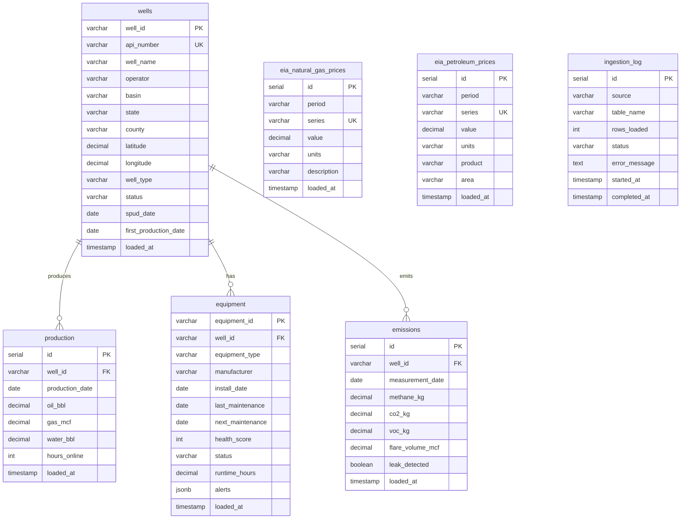

# Database ER Diagram

## Entity Relationship Diagram

## Schema Overview

### Raw Layer (`raw.*`)
| Table | Description | Primary Key | Unique Constraints |
|-------|-------------|-------------|-------------------|
| `wells` | Well master data | `well_id` | `api_number` |
| `production` | Daily production metrics | `id` | `(well_id, production_date)` |
| `equipment` | Equipment health data | `equipment_id` | - |
| `emissions` | Environmental monitoring | `id` | `(well_id, measurement_date)` |
| `eia_natural_gas_prices` | Natural gas prices | `id` | `(period, series)` |
| `eia_petroleum_prices` | Crude oil prices | `id` | `(period, series)` |
| `ingestion_log` | Pipeline run metadata | `id` | - |

### Staging Layer (`staging.*`) - dbt Managed
Views that clean and standardize raw data:
- `stg_wells`, `stg_production`, `stg_equipment`, `stg_emissions`
- `stg_eia_natural_gas_prices`, `stg_eia_petroleum_prices`

### Analytics Layer (`analytics.*`) - dbt Managed
Materialized tables for business metrics:
- `fct_well_performance_daily` - Production with revenue estimates
- `fct_equipment_health` - Maintenance priority scoring
- `fct_emissions_daily` - Environmental risk categories
- `dim_operator_summary` - Operator-level KPIs

## Relationships

| Parent | Child | Relationship | On |
|--------|-------|--------------|-----|
| `wells` | `production` | 1:Many | `well_id` |
| `wells` | `equipment` | 1:Many | `well_id` |
| `wells` | `emissions` | 1:Many | `well_id` |
